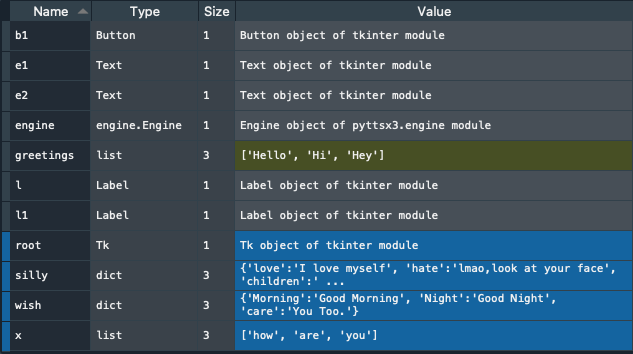
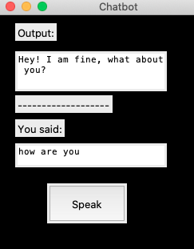

# :octocat: Chatbot

A chatbot is usually a software application used to conduct an on-line chat conversation via text or text-to-speech, in lieu of providing direct contact with a live human agent. Here we have created a chatbot by combining various modules of python.

## 🔨 Basic Working 

The purpose was to create a basic understanding of Python by building up two chatbots. The first one is the manual chatbot where one needs to write up in textfield provided and the bot will try to give appropriate reply. The second part is a kind of autonomus version, where we have used libraries to make it able enough that it recognizes human voice.
- Manual Chatbot :

A basic knowledge of Tkinter library is provided. The field and button is also given on output side so that manual inputs can be given and then submitted to the bot.

- Autonomous Chatbot:

The input is given as the voice of user via microphone. Required libraries are installed for the same, after which the input is show on the display screen. The output for given input is manually given in the form of ```if-else``` statements, for the time being. The ouput is also shown on display screen, making it a basic model of a chatbot that recognizes your voice and try to understand the words accurately.

Spyder provides variable explorer where all the variables that you build or are obtained can all be viwed at one place. Just click on any variable to see the type of data it is storing.




- An example of how the output will appear is shown here. 
## Dependencies

- Python
- Machine Learning Libraries
- Speach Recognizer
- Tkinter Library

## 📦 Install

Open the code ```chatbot.py``` in Spyder after downloading Anaconda and simply run it. Before this download the required modules using 'pip' command so that you can run the code in order to check the output.

Similarly download or update the other modules and libraries for smooth and error-free running of code run the code line by line by pressing ```Ctrl+Enter```, with single or multiple selections.
